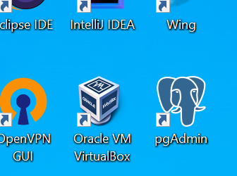
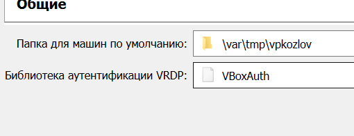
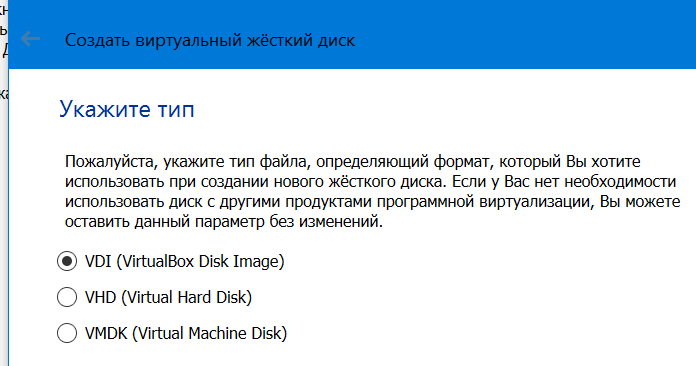
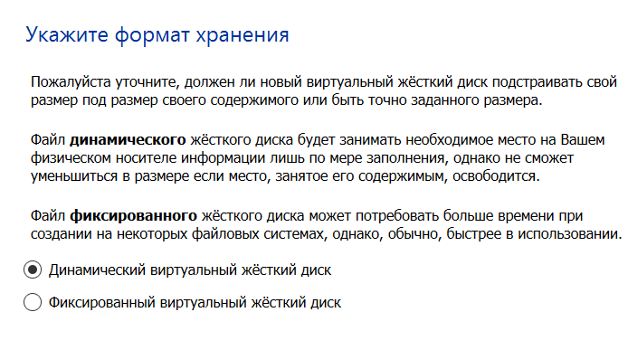
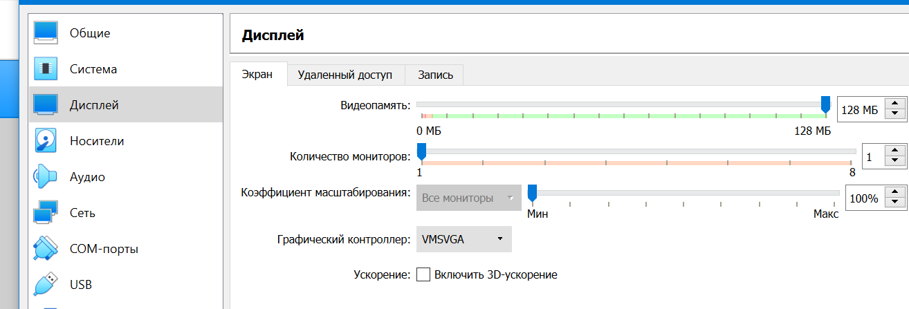
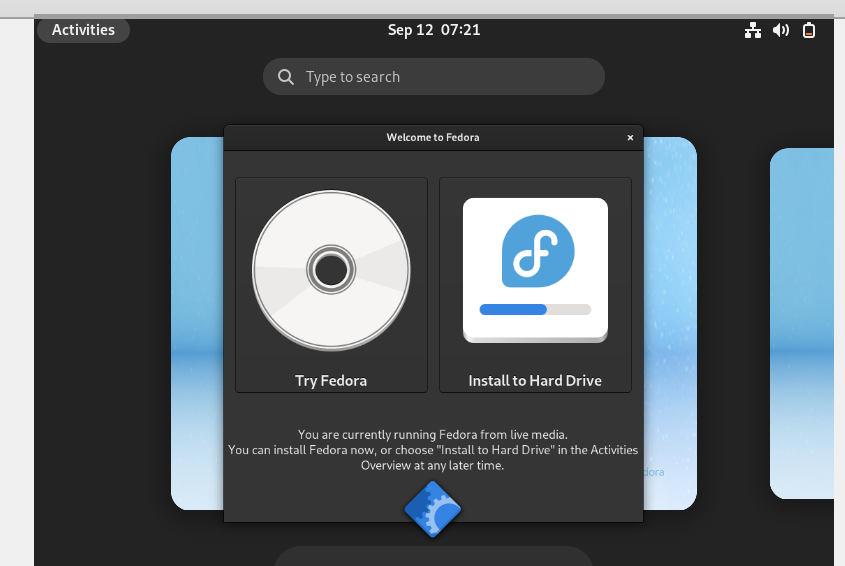

---
## Front matter
title: "Лабораторная работа №1"
subtitle: "Установка и конфигурация операционной системы на виртуальную машину"
author: "Козлов Всеволод Павлович"

## Generic otions
lang: ru-RU
toc-title: "Содержание"

## Bibliography
bibliography: bib/cite.bib
csl: pandoc/csl/gost-r-7-0-5-2008-numeric.csl

## Pdf output format
toc: true # Table of contents
toc-depth: 2
lof: true # List of figures
lot: true # List of tables
fontsize: 12pt
linestretch: 1.5
papersize: a4
documentclass: scrreprt
## I18n polyglossia
polyglossia-lang:
  name: russian
  options:
	- spelling=modern
	- babelshorthands=true
polyglossia-otherlangs:
  name: english
## I18n babel
babel-lang: russian
babel-otherlangs: english
## Fonts
mainfont: PT Serif
romanfont: PT Serif
sansfont: PT Sans
monofont: PT Mono
mainfontoptions: Ligatures=TeX
romanfontoptions: Ligatures=TeX
sansfontoptions: Ligatures=TeX,Scale=MatchLowercase
monofontoptions: Scale=MatchLowercase,Scale=0.9
## Biblatex
biblatex: true
biblio-style: "gost-numeric"
biblatexoptions:
  - parentracker=true
  - backend=biber
  - hyperref=auto
  - language=auto
  - autolang=other*
  - citestyle=gost-numeric
## Pandoc-crossref LaTeX customization
figureTitle: "Рис."
tableTitle: "Таблица"
listingTitle: "Листинг"
lofTitle: "Список иллюстраций"
lotTitle: "Список таблиц"
lolTitle: "Листинги"
## Misc options
indent: true
header-includes:
  - \usepackage{indentfirst}
  - \usepackage{float} # keep figures where there are in the text
  - \floatplacement{figure}{H} # keep figures where there are in the text
---

# Цель работы

Целью данной работы является приобретение практических навыков установки операционной системы на виртуальную машину, настройки минимально необходимых для дальнейшей работы сервисов.

# Выполнение лабораторной работы

Установил VirtualBox (рис. [-@fig:1])

{#fig:1 width = 70%}

Изменил папку для хранения машин (рис. [-@fig:2])

{#fig:2 width = 70%}

Сменил комбинацию для хост клавиш (рис. [-@fig:3])

{#fig:3 width = 70%}

Указал имя и тип ОС (рис. [-@fig:4])

{#fig:4 width = 70%}

Задаю конфигурацию жёсткого диска – загрузочный, VDI (VirtualBox Disk Image), динамический виртуальный диск (рис. [-@fig:5])

{#fig:5 width = 70%}

Указываю формат хранения (рис. [-@fig:6])

{#fig:6 width = 70%}

Увеличиваю доступный объем видеопамяти до 128Мб (рис. [-@fig:7])

{#fig:7 width = 70%}

Устанавливаю операционную систему на Hard Drive (рис. [-@fig:8])

{#fig:8 width = 70%}

# Выводы

Приобрел практические навыки установки операционной системы на виртуальную машину, настройки минимально необходимых для дальнейшей работы сервисов.

# Список литературы{.unnumbered}

::: {#refs}
:::
