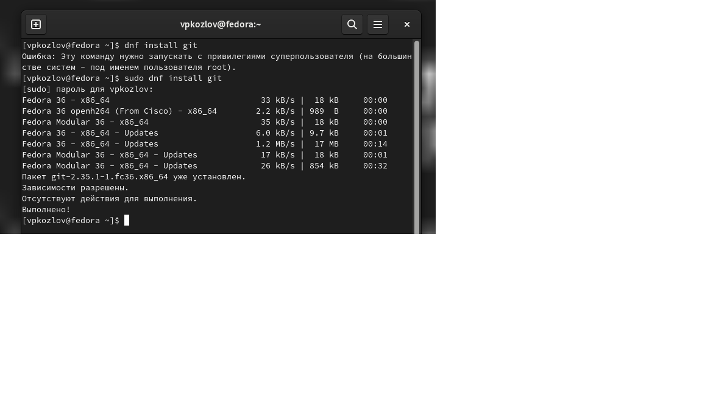
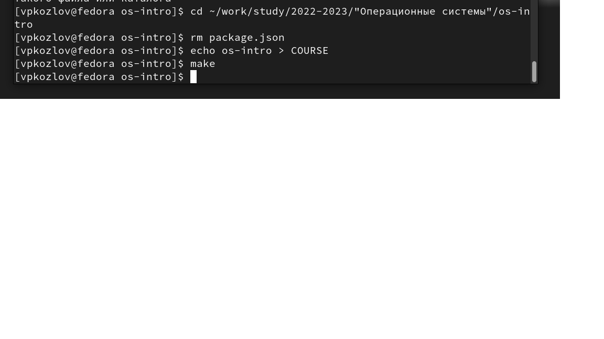
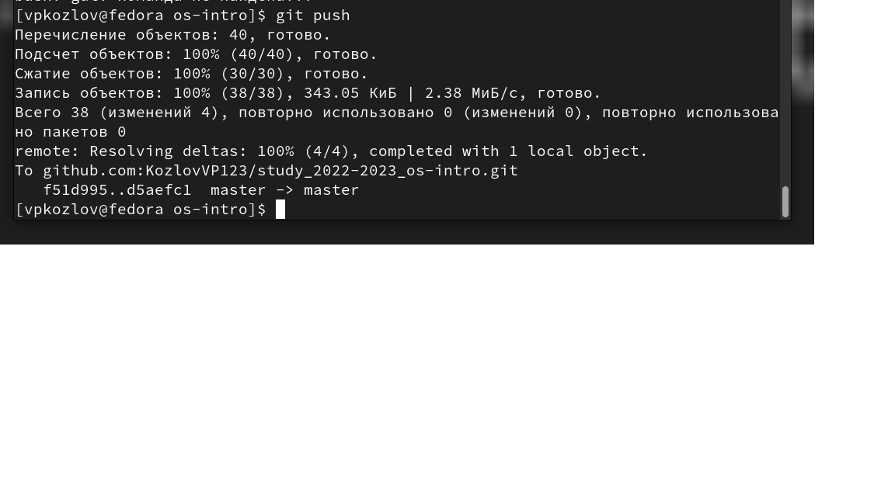

---
## Front matter
title: "Лабораторная работа №2"
subtitle: "Первоначальная настройка Git"
author: "Козлов Всеволод Павлович"

## Generic otions
lang: ru-RU
toc-title: "Содержание"

## Bibliography
bibliography: bib/cite.bib
csl: pandoc/csl/gost-r-7-0-5-2008-numeric.csl

## Pdf output format
toc: true # Table of contents
toc-depth: 2
lof: true # List of figures
lot: true # List of tables
fontsize: 12pt
linestretch: 1.5
papersize: a4
documentclass: scrreprt
## I18n polyglossia
polyglossia-lang:
  name: russian
  options:
	- spelling=modern
	- babelshorthands=true
polyglossia-otherlangs:
  name: english
## I18n babel
babel-lang: russian
babel-otherlangs: english
## Fonts
mainfont: PT Serif
romanfont: PT Serif
sansfont: PT Sans
monofont: PT Mono
mainfontoptions: Ligatures=TeX
romanfontoptions: Ligatures=TeX
sansfontoptions: Ligatures=TeX,Scale=MatchLowercase
monofontoptions: Scale=MatchLowercase,Scale=0.9
## Biblatex
biblatex: true
biblio-style: "gost-numeric"
biblatexoptions:
  - parentracker=true
  - backend=biber
  - hyperref=auto
  - language=auto
  - autolang=other*
  - citestyle=gost-numeric
## Pandoc-crossref LaTeX customization
figureTitle: "Рис."
tableTitle: "Таблица"
listingTitle: "Листинг"
lofTitle: "Список иллюстраций"
lotTitle: "Список таблиц"
lolTitle: "Листинги"
## Misc options
indent: true
header-includes:
  - \usepackage{indentfirst}
  - \usepackage{float} # keep figures where there are in the text
  - \floatplacement{figure}{H} # keep figures where there are in the text
---

# Цель работы

Изучить идеологию и применение средств контроля версий, освоить умения по работе с git.

# Задание

1) Создать базовую конфигурацию для работы с git.
2) Создать ключ SSH.
3) Создать ключ PGP.
4) Настроить подписи git.
5) Зарегистрироваться на Github.
6) Создать локальный каталог для выполнения заданий по предмету.

# Выполнение лабораторной работы

1) Установка Git, gh с последующей базовой настройкой (рис. [-@fig:001])

{ #fig:001 width = 70% } 

2) Настройка верификации и подписания коммитов git (рис. [-@fig:005])

{ #fig:005 width=70%} 

Задал имя начальной ветви, настроил пареметры autocrlf и safecrlf (рис. [-@fig:010])

{ #fig:010 width=70%} 

3) Создание ключа SSH:

Создал SSH ключ по алгоритму rsa размером 4096 бит (рис. [-@fig:011])

{ #fig:011 width=70% }

4) Регистрация на Github - произведена ранее

5) Настройка gh:

Авторизировался на gh (рис. [-@fig:013])

{ #fig:013 width=70% }

6) Создание репозитория курса на основе шаблона:

Потребовалась помощь Татьяны Рефатовны, забыл сделать скриншот

7)) Настройка каталога курса:

Удалил лишние файлы и создал необходимые каталоги (рис. [-@fig:014])

{ #fig:014 width=70% }

Отправил файлы на сервер (push) (рис. [-@fig:016])

{ #fig:016 width=70% }

# Выводы

Изучил идеологию и применение средств контроля версий, освоил умения по работе с git.

# Список литературы{.unnumbered}

::: {#refs}
:::
