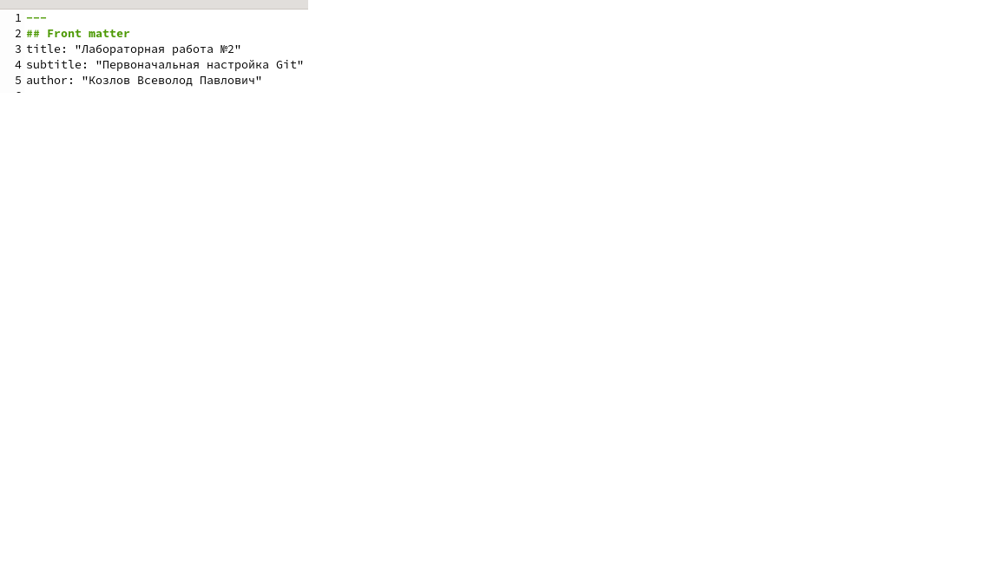
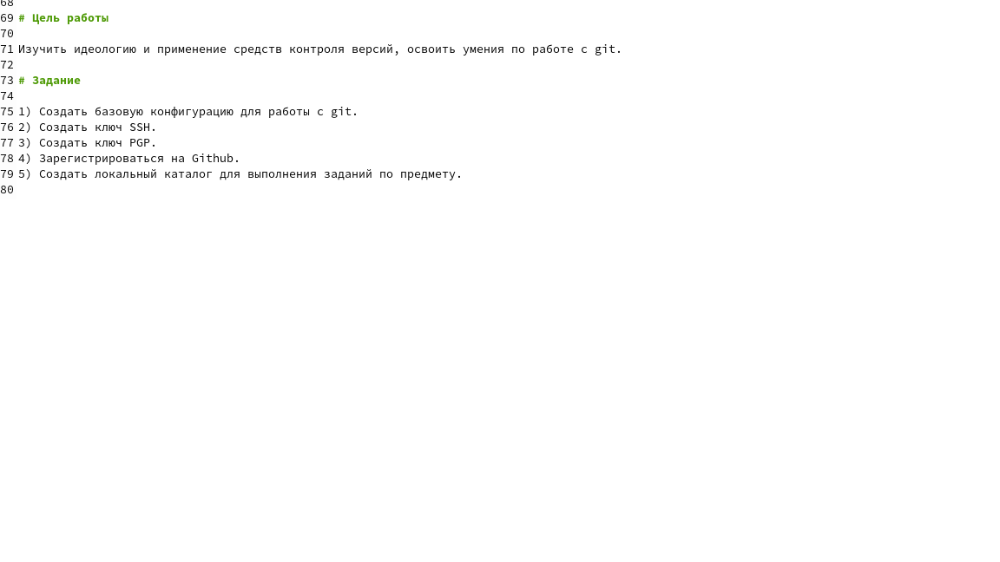
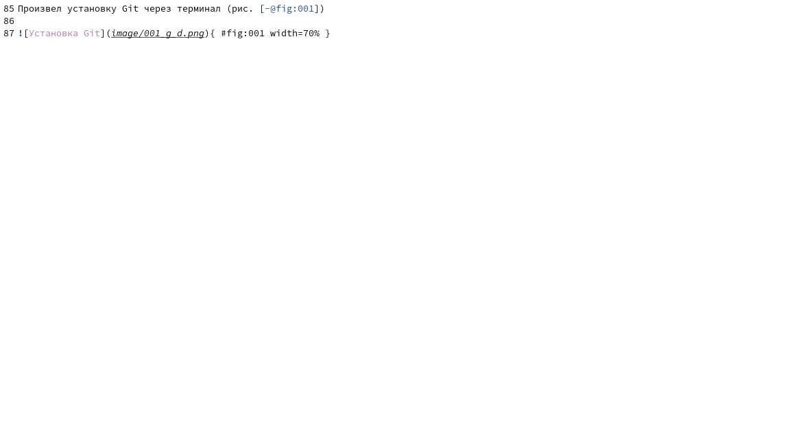
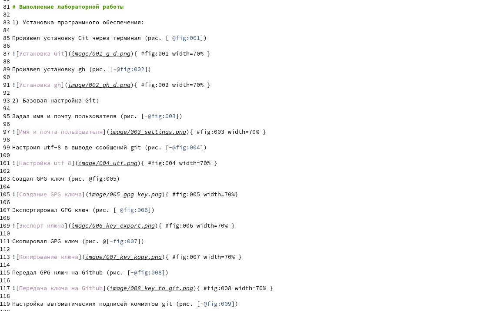
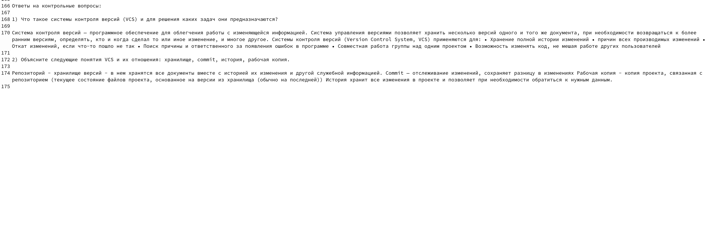
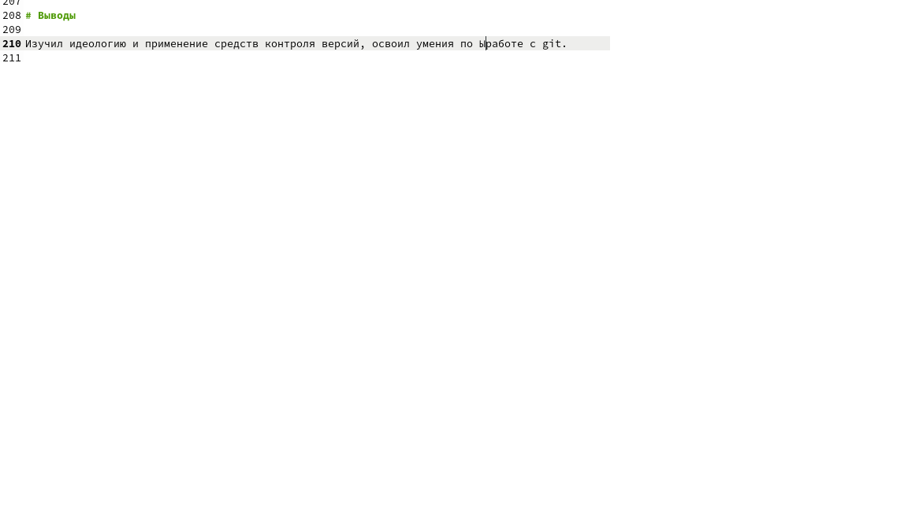

---
## Front matter
title: "Лабораторная работа №3"
subtitle: "Markdown"
author: "Козлов Всеволод Павлович"

## Generic otions
lang: ru-RU
toc-title: "Содержание"

## Bibliography
bibliography: bib/cite.bib
csl: pandoc/csl/gost-r-7-0-5-2008-numeric.csl

## Pdf output format
toc: true # Table of contents
toc-depth: 2
lof: true # List of figures
lot: true # List of tables
fontsize: 12pt
linestretch: 1.5
papersize: a4
documentclass: scrreprt
## I18n polyglossia
polyglossia-lang:
  name: russian
  options:
	- spelling=modern
	- babelshorthands=true
polyglossia-otherlangs:
  name: english
## I18n babel
babel-lang: russian
babel-otherlangs: english
## Fonts
mainfont: PT Serif
romanfont: PT Serif
sansfont: PT Sans
monofont: PT Mono
mainfontoptions: Ligatures=TeX
romanfontoptions: Ligatures=TeX
sansfontoptions: Ligatures=TeX,Scale=MatchLowercase
monofontoptions: Scale=MatchLowercase,Scale=0.9
## Biblatex
biblatex: true
biblio-style: "gost-numeric"
biblatexoptions:
  - parentracker=true
  - backend=biber
  - hyperref=auto
  - language=auto
  - autolang=other*
  - citestyle=gost-numeric
## Pandoc-crossref LaTeX customization
figureTitle: "Рис."
tableTitle: "Таблица"
listingTitle: "Листинг"
lofTitle: "Список иллюстраций"
lotTitle: "Список таблиц"
lolTitle: "Листинги"
## Misc options
indent: true
header-includes:
  - \usepackage{indentfirst}
  - \usepackage{float} # keep figures where there are in the text
  - \floatplacement{figure}{H} # keep figures where there are in the text
---

# Цель работы

Научиться оформлять отчёты с помощью легковесного языка разметки Markdown.

# Задание

Объяснить создание отчета по второй лабораторной работе в Markdown.

# Выполнение лабораторной работы

1) Создание титульного листа:

Прописал номер лабораторной работы, ее название и автора (рис. [-@fig:001])

{#fig:001 width 70%}

2) Цель работы и задание:

Сформулировал цель работы и задание (рис. [-@fig:002])

{#fig:002 width 70%}

3) Ход выполнения второй лабораторной работы:

Краткий пример создания скриншота, его названия и информационного текста (рис. [-@fig:003])

{#fig:003 width 70%}

Создание описания хода лабораторной работы №2 (частичный скриншот хода лабораторной работы) (рис. [-@fig:004])

{#fig:004 width 70%}

Ответил на контрольные вопросы (частичный скриншот ответов на вопросы) (рис. [-@fig:005])

{#fig:005 width 70%}

4) Вывод к лабоаторной работе №2:

Сформулировал вывод ко второй лабораторной работе (рис. [-@fig:006])

{#fig:006 width 70%}

# Выводы

Научился оформлять отчёты с помощью легковесного языка разметки Markdown.

::: {#refs}
:::
